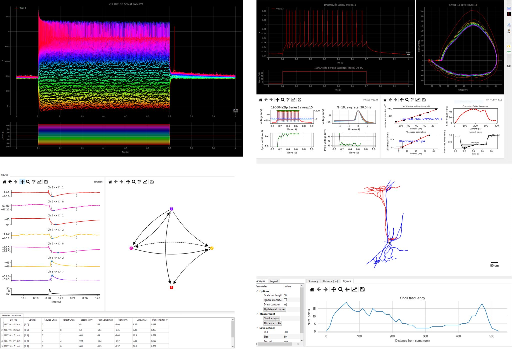

===============
PatchView
===============
.. image:: https://img.shields.io/pypi/v/patchview.svg 
        :target: https://pypi.python.org/pypi/patchview
      
.. image:: https://img.shields.io/badge/python-3.10%2B-blue
        :target: https://www.python.org/downloads/release/python
        :alt: Python3.8

.. image:: https://readthedocs.org/projects/patchview/badge/?version=latest
        :target: https://patchview.readthedocs.io/en/latest/?badge=latest
        :alt: Documentation Status

.. image:: https://img.shields.io/badge/code%20style-black-000000.svg
    :target: https://github.com/psf/black

.. image:: https://img.shields.io/badge/License-BSD%203--Clause-blue.svg
        :target: https://opensource.org/licenses/BSD-3-Clause
        :alt: BSD-3-Clause    

.. image:: https://joss.theoj.org/papers/10.21105/joss.04706/status.svg
   :target: https://doi.org/10.21105/joss.04706
.. image:: https://img.shields.io/pypi/dm/patchview?label=pypi%20downloads
           

PatchView perform data analysis and visualization on multi channel whole-cell recording (multi-patch) data, including firing pattern analysis, event analysis,
synaptic connection detection, morphological analysis and more.

* Free software: BSD 3-Clause license
* Documentation: https://patchview.readthedocs.io.

Features
--------
PatchView integrates multiple open-source tools (see credit page) and wrap them using an intuitive graphic user interface (GUI).
Thus users can perform most analysis quickly for the data collected in a typical patch-clamp experiment without installing Python and 
these tools or writing any Python scripts.

* Importing both Heka data and Axon Instruments data. Exporting to Python pickle file or NWB (Neurodata Without Borders) file format.
* Visualizing single and multiple traces with zoom, pan operations.
* Automatically sorting experiments data according to predefined labels.
* Performing analysis on intrinsic membrane properties, action potential detection, firing pattern analysis.
* Synaptic connection analysis.
* Visualizing and quantification of neuron's morphological reconstruction from Neurolucida

Citation
---------
If you find our work useful for your research, please cite:

    Hu et al., (2022). PatchView: A Python Package for Patch-clamp Data Analysis and Visualization. Journal of Open Source Software, 7(78), 4706, https://doi.org/10.21105/joss.04706
