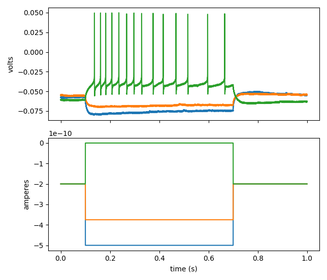

==============
Python APIs
==============
In addition to the GUI interface, you can also access data in Python via two ways:

Heka APIs
----------
Code snippet shows how to read data from original Heka .dat file.

.. code-block:: python
    :linenos:

    ## import HekaHelpers which is a wrapper of main file: HEKA_Reader_MAIN
    from patchview.HekaIO.HekaHelpers import HekaBundleInfo

    ## read Heka .dat file into a object
    # test file is the full path for your Heka .dat file
    bundleTester = HekaBundleInfo(testFile)

    ## Get sample rate
    traceIndex = [0,0,0,0] ## [Group, Series, Sweep, Trace]
    bundleTester.getSeriesSamplingRate(traceIndex)

    ## Get stimuli information
    time, stim, stimInfo = bundleTester.getStim(traceIndex)

    ## Get data from a single sweep and single channel
    data = bundleTester.getSingleTraceData(traceIndex)

NWB (NeurodataWithoutBorders) APIs
-------------------------------------
Code snippet shows how to convert data from original Heka .dat file into NWB format.

.. code-block:: python
    :linenos:

    from patchview.utilitis.PVdat2NWB import dat2NWB

    seriesIndex = [0,0] # [Group, Series]
    data = dat2NWB(testFile, seriesIndex) # read data as NWB format

    ## get number of sweeps
    print(f'Number of sweeps: {data.getNumberOfSweeps()}')

    ## data is now a NWB object with additional plotting functions
    stim, resp = nwbData.getSweep(0) # get one sweep's stimulus and responses

    ## directly plot sweep 0, 5, 20
    data.plotSweep([0, 5, 20]) # plot three sweeps

The last command in the block above should give you a figure like this:

