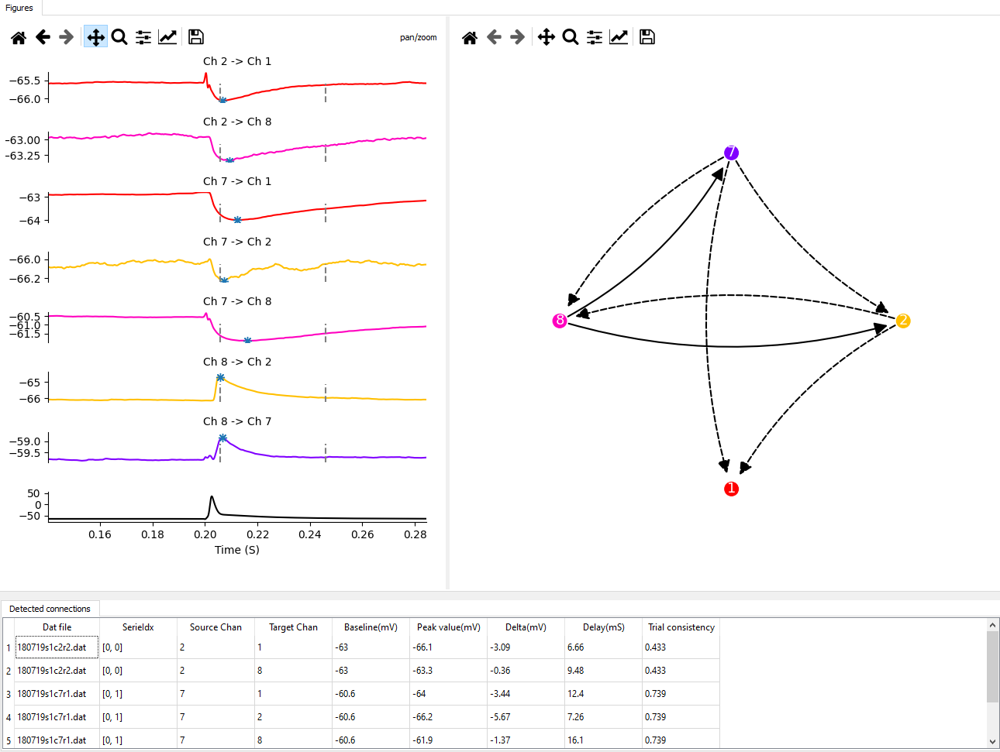

============
Introduction
============
Patchview has multiple modules that could be accessed from the tabs in the main window.
Each tab host one module. Below we introduce the functions of each module.

**Quick browser**
-----------------
Due to the complexity of data generated from a patch-clamp experiment, we need lots of visualization to 
help us navigate and make sense of the data, especially during the data exploration phase.
Following are examples of visualizations that PatchView can do. 

- Parsing HEKA PatchMaster data bundle (.dat) and rendering the data structure (a tree) in a pyqtgraph tree widget (
  left middle panel).
- You can then select single (left clicking a sweep) or multiple traces (by pressing Ctrl key while left clicking
  multiple traces in the tree widget). Three representative sweeps from the entire series data will be plotted if you click at "Series" level. The plots are pyqtgraph's
  buildin plotwidget, thus all default operations (zoom-in, pan etc. ) are supported.

*Plotting single trace*
^^^^^^^^^^^^^^^^^^^^^^^^^^^^
Top panel: voltage for a sweep. Bottom panel: stimulus input. Same conventions for all related plots below. 

*Plotting multiple trace*
^^^^^^^^^^^^^^^^^^^^^^^^^^^
Multiple sweeps (indicated by different colors) from a a single series. Colors lines for Stimuli traces
match with that of voltage traces.

*Plotting the full series*
^^^^^^^^^^^^^^^^^^^^^^^^^^^^

.. image:: resources/images/pasedavian_003_series.png
    :width: 800
    :alt: Alternative text

**Firing Pattern analysis**
----------------------------
*Detect spikes*
^^^^^^^^^^^^^^^^^
PatchView currently utilize an adapted early version of `IPFX`_  package to detect spikes and extract relevant features of the cell from those spikes and hyperpolarized traces.
For more, see `IPFX`_ page from Allen Brain Institute.

For each spike, PatchView plots its phase plot (dV/dt verse V) (Shown in top right corner), spike widths, peak hight (bottom left corner).

.. _IPFX: https://github.com/AllenInstitute/ipfx

*Extract neuron's features*
^^^^^^^^^^^^^^^^^^^^^^^^^^^^
PatchView extract all these features and present the results in three separate tables: by Sweep, by Spikes, and by Cells.
IPFX provide some parameters for its detection procedures. These parameters can be adjusted in the *spike detection* tab
on the left side.

**Monosynaptic connection detection**
-------------------------------------------
For Multi-patch experiment, multiple (up to 12) neurons were recorded simultaneously. In each sweep, one the neuron were either electrically 
or optically stimulated above its firing threshold. A postsynaptic event may be observed in short latency if it receives monosynaptic connections
from the stimulated neuron.

Detected synaptic network is visualized using `NetworkX <https://networkx.org/>`_

**Postsynaptic event (PSP/PSC) analysis**
-------------------------------------------
A deconvolution-based (Pernia-Andrade et al.) method is implemented to detect mini event.

* Pernia-Andrade, A. J. et al. A deconvolution-based method with high sensitivity and temporal resolution for detection of spontaneous synaptic currents in vitro and in vivo. Biophys J 103, 1429–1439 (2012)

We provide a rich GUI to specify template, adjust parameters of detection algorithms,  visual inspection of events and manual curating. A table is generated with each event's information.
User can inspect each event, either by clicking item in the table or quickly browsing using arrow key. 
User can also flag individual event as False before exporting the whole table. 

**Morphological data**
---------------------------
Internally, PatchView utilize an adapted version of `NeuroM <https://github.com/BlueBrain/NeuroM>`_  from the Blue Brain Project for tree recontruction and associated analysis with custom added functionalities (
such as measure cell's distance to Pia). 
- Parsing Neurolucida file (.asc) and rendering the tree structure (both 2D and 3D).

*Plotting soma and neurites for a single neuron*
^^^^^^^^^^^^^^^^^^^^^^^^^^^^^^^^^^^^^^^^^^^^^^^^^

.. image:: resources/images/pasedavian_004_morphology.png
    :width: 800
    :alt: Alternative text

*Plotting somas for a group of neurons*
^^^^^^^^^^^^^^^^^^^^^^^^^^^^^^^^^^^^^^^^^^^
Centroids of somas are listed in a table (bottom right) which can be exported into tsv file by context menu
(right clicking the table to show) associated with the table.  

.. image:: resources/images/pasedavian_004_morphology_soma.png
    :width: 800
    :alt: Alternative text

