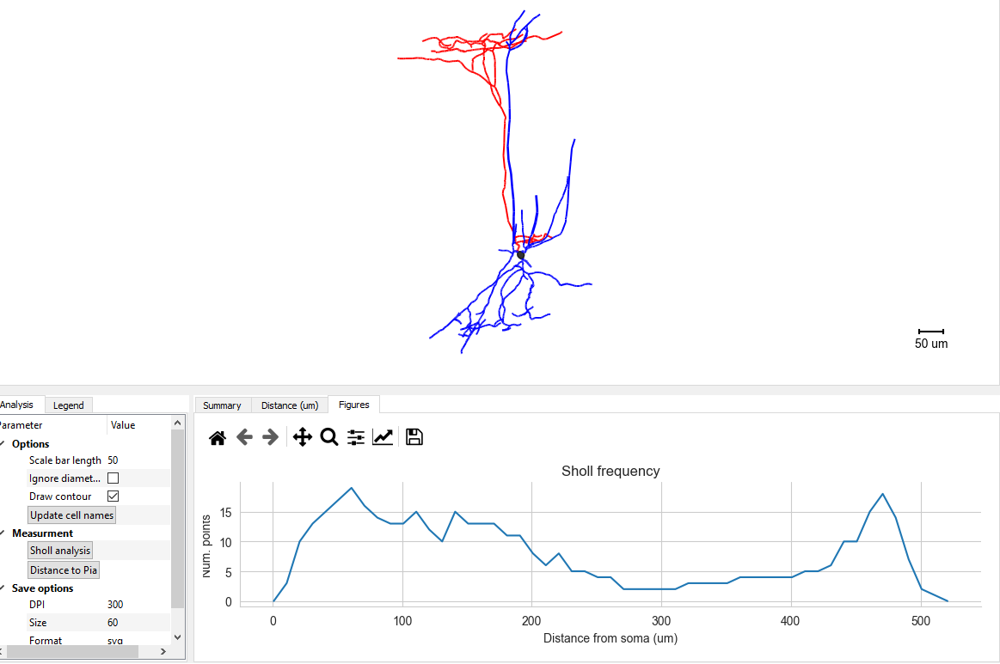

================
GUI Tutorials
================
Here, we walk through the main steps to use PatchView.

**Loading data**
-----------------
Patchview provides multiple ways to import data.

*import single file*
^^^^^^^^^^^^^^^^^^^^^^
Use the file browser to expand (click the arrow) directories. Once located the file (.dat, .abf for electrophysiology data; .asc for Morphological data), double clicking
the file. The contents of this file will be represented as a hierarchical tree in a tab named "Current tree" in the
left panel. Click the arrow at start of the name to expand. 

*import multiple files simultaneously*
^^^^^^^^^^^^^^^^^^^^^^^^^^^^^^^^^^^^^^^

**Note**: this method assume that you follow a naming convention: date-slice#-cell#. For example, 20220202s1c1.dat, means
this file was recorded on date 2022/02/02 from slice 1 and cell 1. 

Sometimes, you may record multiple cells from a single slice (check test data in `tests\data\connection_tests`). Each cell's recording may be stored in a separate file. 
Or, they were stored in a single file. And You may also record multiple slices from a single day.
The following method would enable you importing cells from a single slice (possibly in multiple files). 

Right click the folder that contains data files, a context menu would pop out. Clicking "import files", a dialog box with
a dropdown list of each individual slice name and "All slice". Selecting the former will load files from same slice.
Selecting 'All slices' will load all files in the current folder. 

An advantage of loading data in this way is that PatchView will try to sort series by their protocol. Some common protocols
in a multi-patch experiment test for firing pattern, connection and spontaneous event. In Heka patchmaster, you can specify
a unique label for each protocol: for example, 'FP' for firing pattern; 'EPSP' for excitatory post synaptic potential.
PatchView would read those labels and sort each recorded series into corresponding tabs shown in the first middle panel.
Currently three tabs are available: "Firing pattern", "Connection", "Spontaneous". Once data is loaded and sorted, the context menu provides entry point to additional analysis (see below).  

**GUI interactions**
-------------------------------------

**Left button**:  Left mouse button have two modes of interaction: Rect mode |mouseMode1| and Pan mode |mouseMode2|. 

* Rect mode: Left click and drag a rectangle around the region of interest to zoom in.
* Pan mode:  Interacts with items in the scene (select/move objects, etc). If there are no movable objects under the mouse cursor, then dragging with the left button will pan the scene instead. 

Rect mode is default. Click the corresponding icon in the toolbar (far right column in GUI) to switch between
those two modes.

**Right Button**:

* Right button drag: Scales the scene. Dragging left/right scales horizontally; dragging up/down scales vertically (although some scenes will have their x/y scales locked together). If there are x/y axes visible in the scene, then right-dragging over the axis will _only_ affect that axis. 
* Right button clicks: Clicking the right button in most cases will show a context menu with a variety of options depending on the object(s) under the mouse cursor. 

**Firing Pattern analysis**
----------------------------
*single series FP analysis*
^^^^^^^^^^^^^^^^^^^^^^^^^^^^^
Right clicking the Series in the "Current tree" tab, choose "Firing pattern analysis". This will trigger firing pattern
analysis for the whole series. The results are shown in two formats in the "Firing pattern" tab: 

* the top panel shows aligned spike waveform in the first 16 sweeps that have at least one spikes.
* the bottom left panel have three tabs. Each tab holds a table for sweep-wise, spike-wise and cell-wise features.

*multiple series FP analysis*
^^^^^^^^^^^^^^^^^^^^^^^^^^^^^^^
Load all series of interests using method described in **import multiple files simultaneously** section. Invoke firing 
pattern analysis from the context menu of the "Firing patterns (Batch)" tab in the first middle left panel. This will perform firing pattern analysis for all ("batch") series listed .

**Monosynaptic connection detection**
-------------------------------------------
Same loading method as the multiple series FP analysis. If the files are successfully loaded (see figure below), there should be a list of 
files of firing pattern in the `Connection` tab. Invoke **Synaptic connections (Batch)** from the context menu of 
the `Connection`` tab in the first middle left panel. After a few seconds, GUI would automatically switch to `Connections` view to show traces with possible connection.

**Postsynaptic event (PSP/PSC) analysis**
-------------------------------------------
Load file that has spontaneous event series. Right click the series of interest to invoke context menu. Left click
"Spontaneous event analysis" will load the series and activate the "Event detection" tab. 

The top two panels show the original trace (left) and template or detected events (right). The bottom left panel have
several tabs, which hold parameters widget and actionable buttons. Major operations are done through this panel. The
bottom right panel show tables of various intermediate results and figures.

To start, activate the "Preprocessing" tab at the bottom left panel. This tab enables select sweep and traces within
currently loaded series. It also has various parameters for preprocessing.

*Specify templates*
^^^^^^^^^^^^^^^^^^^^^^
Next, activate "Template" tab. Move cursor into the left upper panel to specify several typical events as template. See the following
picture for how to do this. Once templates are collected, click "Fit" in the tab to get a bi-exponential fit of the averaged event.
The top right panel will now show the averaged the template and its fit together with time constant of rising and decay phase time constants.
The "Template Fit" tab in the bottom right area will represent extra information about the fit.

*detect events*
^^^^^^^^^^^^^^^^^^^^^^
Once the template fit is finished, activate "Peak detection" tab. Then click "Detect current sweep" button to analyze events
for current sweep, or "Detect events for all sweeps" for all sweeps.  See the following graphic guide. 

*visualize and manually curate events*
^^^^^^^^^^^^^^^^^^^^^^^^^^^^^^^^^^^^^^^

*Postprocessing and exporting*
^^^^^^^^^^^^^^^^^^^^^^^^^^^^^^^
The "Event postprocessing" tab summarize the results with event histograms. The wave forms and tables can also be exported
from here.

**Morphological data**
---------------------------
Patchview currently only support neurolucida ASC files. These files should be listed in the file browser panel.
Double clicking the file would load the file. Visualization and further analysis results are shown in the `Morphology` tab.

Dependent on the content of the file, Patchview can perform:

* **pairwise distance of multiple somas**: this is automatically done if the reconstruction has multiple somas in it (check the test file: `test_multiSoma.ASC`)

*  **Update cell names**: this can be done for a multi-soma file. The `Name` column in the `Summary` table can be edited. After the editing, clicking `Update cell names` will update the Pair names in the  pairwise distance table  in `Distance (um)` tab.
  
* **Sholl analysis**: if the reconstruction has at least one neurite, this will perform Sholl analysis (counting neurite numbers in a ring from certain soma distance). A line plot (count vs distance) is shown in the `Figures` tab. Try `test.ASC`.

* **Density analysis**: Visualizing neurites density in either Cartesian or polar coordinates.
  

    

*  **Distance to Pia**: if the reconstruction contains a entry labeled "Pia" (check the test file: `test_multiSoma.ASC`), this will measure Euclidean distance from the center of a soma to the Pia. Measured results are shown in the `Distance to Pia` column in `Summary` table.

**Note**: the figure sometimes (more so under Ubuntu) does not automatically refresh. If it happens, drag the border between upper and lower panels to manually refresh.

**Toolbar items**
------------------------

Simple explanation for each icon will be show as tooltip when Hovering over each icon.

The first tool item |mouseInteract| is to switch mouse interation mode as explained above. 

The second tool item |sliceview| is to load slice imaging into the tab "Slice view".

The third |CR|  and fourth item  |corr| is to calculate correlations values in a multi-patch experiment: an index to quantify voltage dependent pair-wise Pearson correlation between raw voltage traces within a user specified time window.
Example images below could be reproduced by doing CR with the test data `test_couplingRatio.dat` (Series2)

Note: significant coupling is highlighted with red title (from chan 8 to chan2 in this case).

**Exporting data**
---------------------------
File menu provides two exporting options. `Export .pkl` exports currently selected series into a Python pickle object. `Export .NWB` exports into neurodata-without-borders format.

