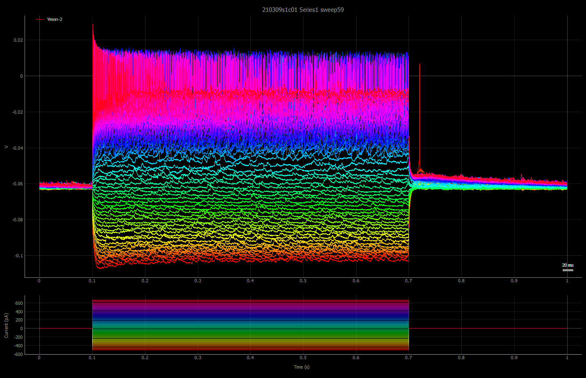
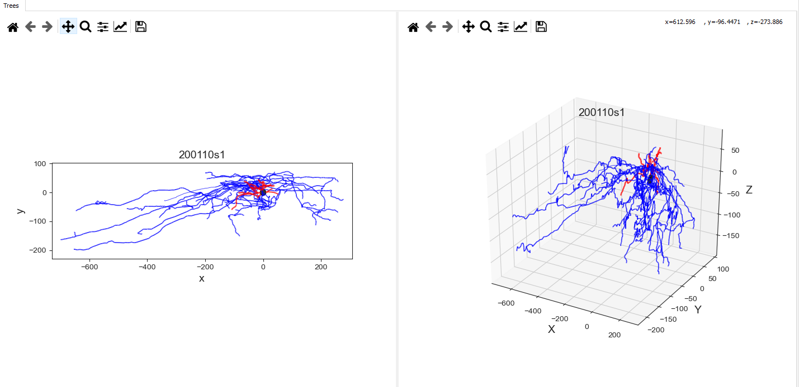
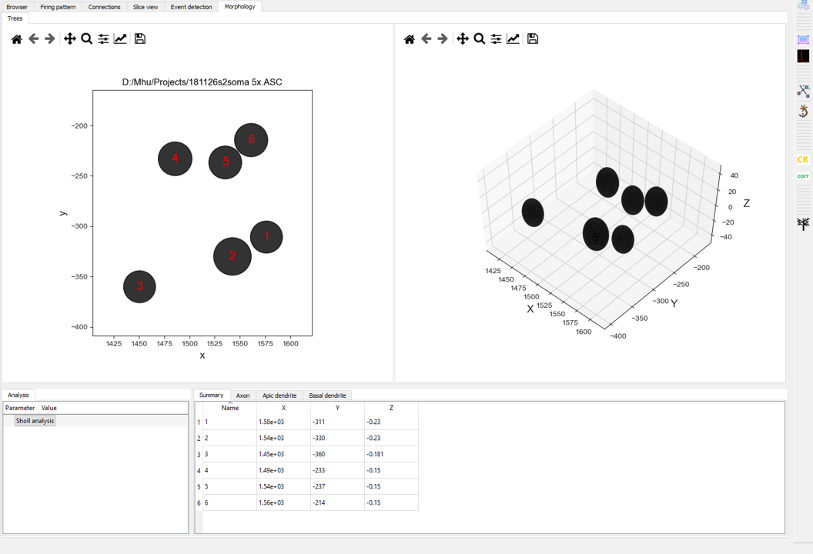

============
Introduction
============

Electrophysiology data
========================================
Due to the complexity of data generated from a patch-clamp experiment, we need lots of visualization to 
help us navigate and make sense of the data, especially during the data exploration phase.
Following are examples of visualizations that PatchView can do. 

- Parsing HEKA PatchMaster data bundle (.dat) and rendering the data structure (a tree) in a pyqtgraph tree widget (
  left middle panel).
- You can then select single (left clicking a sweep) or mutiple traces (by pressing Ctrl key while left clicking
  mutiple traces in the tree widget). The full series data will be plotted if you click at "Series" level. The plots are pyqtgraph's
  buildin plotwidget, thus all default operations (zoom-in, pan etc. ) are supported.

*Ploting single trace*
^^^^^^^^^^^^^^^^^^^^^^^^^^^^^^^^^^^^^^^^^^^^^^^^^^^^^^^^^^^^^^^^^^^
Top panel: voltage for a sweep. Bottom panel: stimulus input. Same conventions for all related plots below. 

.. image:: resources/images/pasedavian_001_trace.png
    :width: 800
    :alt: Alternative text

*Plotting multiple trace*
^^^^^^^^^^^^^^^^^^^^^^^^^^^
Multiple sweeps (indicated by differnt colors) from a a single series. Colors lines for Stimuli traces
match with that of voltage traces.

.. image:: resources/images/pasedavian_002_multTraces.png
    :width: 800
    :alt: Alternative text

*Plotting the full series*
^^^^^^^^^^^^^^^^^^^^^^^^^^^^

Morphorlory data
========================================

- Parsing Neurolucida file (.asc) and rendering the tree structure (both 2D and 3D).

*Plotting soma and neurites for a single neuron*
^^^^^^^^^^^^^^^^^^^^^^^^^^^^^^^^^^^^^^^^^^^^^^^^^

*Plotting somas for a group of neurons*
^^^^^^^^^^^^^^^^^^^^^^^^^^^^^^^^^^^^^^^^^^^
Centroids of somas are listed in a table (bottom right) which can be exported into tsv file by context menu
(right clicking the table to show) associated with the table.  

